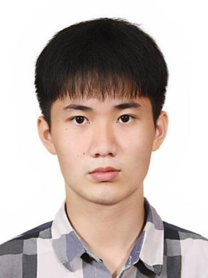
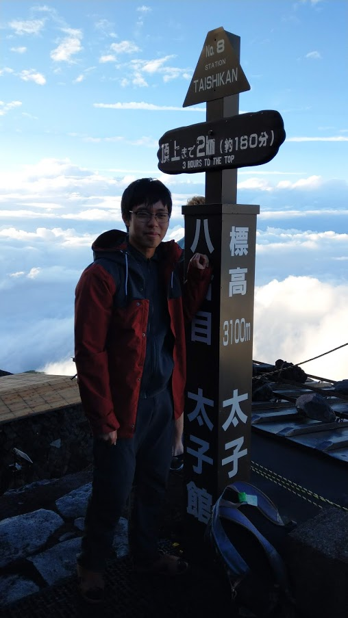
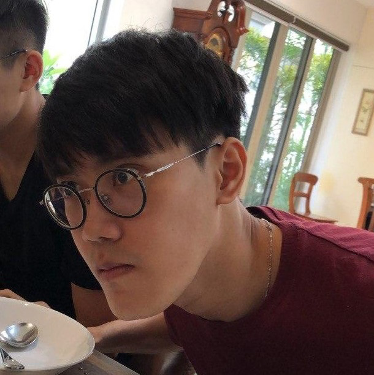

We are a team based in the [School of Computing, National University of Singapore](http://www.comp.nus.edu.sg).

You can reach us through [GitHub](https://github.com/AY2021S1-CS2103T-W17-4).

## Project team

### Zhu Xiaochen

[[GitHub](https://github.com/zhXchD)][[Portfolio](team/zhxchd.md)]

* Role: Team lead
* Responsibilities:
    * Code integration

### Lin Geyu

[[Github](https://github.com/Lingy12)][[Portfolio](team/lingy12.md)]

* Role: developer
* Responsibilities:
    * Deliverables and deadlines
    * Scheduling and tracking

### Lin Zhengyang

[[GitHub](https://github.com/Nauw1010)]

* Role: developer
* Responsibilities:
    * UI
    * Logic

### Jazer Ler

[[GitHub](https://github.com/jazerler)]

* Role: developer
* Responsibilities:
    * Code integration

### Joshua Liang

[[GitHub](https://github.com/joshualiangxy)][[Portfolio](team/joshualiangxy.md)]

* Role: developer
* Responsibilities:
    * Documentation/testing/code quality
    * Storage

