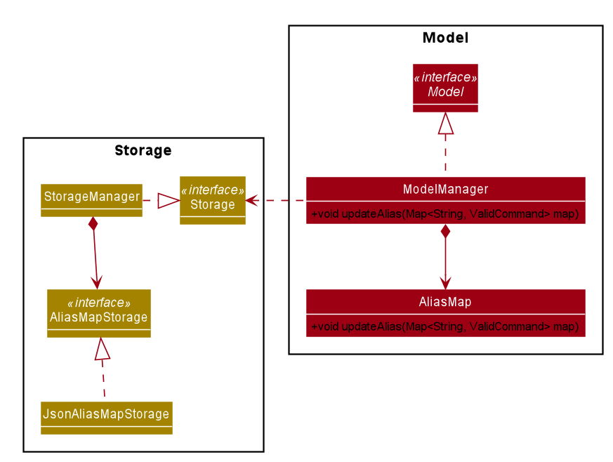

* Table of Contents
{:toc}

--------------------------------------------------------------------------------

## **Setting up, getting started**

Refer to the guide [_Setting up and getting started_](SettingUp.md).

--------------------------------------------------------------------------------

## **Design**

### Architecture


The ***Architecture Diagram*** given above explains the high-level design of the
App. Given below is a quick overview of each component.

**`Main`** has two classes called [`Main`](https://github.com/AY2021S1-CS2103T-W17-4/tp/blob/master/src/main/java/seedu/address/Main.java)
and [`MainApp`](https://github.com/AY2021S1-CS2103T-W17-4/tp/blob/master/src/main/java/seedu/address/MainApp.java).
It is responsible for,
* At app launch: Initializes the components in the correct sequence, and connects them up with each other.
* At shut down: Shuts down the components and invokes cleanup methods where necessary.

[**`Commons`**](#common-classes) represents a collection of classes used by multiple other components.

The rest of the App consists of four components.

* [**`UI`**](#ui-component): The UI of the App.
* [**`Logic`**](#logic-component): The command executor.
* [**`Model`**](#model-component): Holds the data of the App in memory.
* [**`Storage`**](#storage-component): Reads data from, and writes data to, the hard disk.

Each of the four components,

* defines its *API* in an `interface` with the same name as the Component.
* exposes its functionality using a concrete `{Component Name}Manager` class (which implements the corresponding API `interface` mentioned in the previous point.

For example, the `Logic` component (see the class diagram given below) defines its API in the `Logic.java` interface and exposes its functionality using the `LogicManager.java` class which implements the `Logic` interface.


**How the architecture components interact with each other**

The *Sequence Diagram* below shows how the components interact with each other for the scenario where the user issues the command `delete 1`.


The sections below give more details of each component.

### UI component


**API** :
[`Ui.java`](https://github.com/AY2021S1-CS2103T-W17-4/tp/blob/master/src/main/java/seedu/address/ui/Ui.java)

The UI consists of a `MainWindow` that is made up of parts e.g.`CommandBox`, `ResultDisplay`, `PersonListPanel`, `StatusBarFooter` etc. All these, including the `MainWindow`, inherit from the abstract `UiPart` class.

The `UI` component uses JavaFx UI framework. The layout of these UI parts are defined in matching `.fxml` files that are in the `src/main/resources/view` folder. For example, the layout of the [`MainWindow`](https://github.com/AY2021S1-CS2103T-W17-4/tp/blob/master/src/main/java/seedu/address/ui/MainWindow.java) is specified in [`MainWindow.fxml`](https://github.com/AY2021S1-CS2103T-W17-4/tp/blob/master/src/main/resources/view/MainWindow.fxml)

The `UI` component,

* Executes user commands using the `Logic` component.
* Listens for changes to `Model` data so that the UI can be updated with the modified data.

### Logic component


**API** :
[`Logic.java`](https://github.com/AY2021S1-CS2103T-W17-4/tp/blob/master/src/main/java/seedu/address/logic/Logic.java)

1. `Logic` uses the `CommandParser` class to parse the user command.
1. This results in a `Command` object which is executed by the `LogicManager`.
1. The command execution can affect the `Model` (e.g. adding a person).
1. The result of the command execution is encapsulated as a `CommandResult` object which is passed back to the `Ui`.
1. In addition, the `CommandResult` object can also instruct the `Ui` to perform certain actions, such as displaying help to the user.

Given below is the Sequence Diagram for interactions within the `Logic` component for the `execute("delete 1")` API call.


<div markdown="span" class="alert alert-info">:information_source: **Note:** The lifeline for `DeleteCommandParser` should end at the destroy marker (X) but due to a limitation of PlantUML, the lifeline reaches the end of diagram.
</div>

### Model component


**API** : [`Model.java`](https://github.com/AY2021S1-CS2103T-W17-4/tp/blob/master/src/main/java/seedu/address/model/Model.java)

The `Model`,

* stores a `UserPref` object that represents the user’s preferences.
* stores the address book data.
* stores the journal data.
* exposes an unmodifiable `ObservableList<Person>` and `ObservableList<Entry>` that can be 'observed', e.g. the UI
 can be bound to this list so that the UI automatically updates when the data in the list change.
* does not depend on any of the other four components.


<div markdown="span" class="alert alert-info">:information_source: **Note:** An alternative (arguably, a more OOP) model is given below. It has a `Tag` list in the `AddressBook`, which `Person` references. This allows `AddressBook` to only require one `Tag` object per unique `Tag`, instead of each `Person` needing their own `Tag` object.<br>


Similarly, an alternative model for the Journal is given below. Like the model above, it has a `Tag` list in the
 `Journal`, which `Entry` references, allowing `Journal` to only require one `Tag` object per unique `Tag`, instead
  of each `Entry` needing their own `Tag` object.


</div>


### Storage component


**API** : [`Storage.java`](https://github.com/AY2021S1-CS2103T-W17-4/tp/blob/master/src/main/java/seedu/address/storage/Storage.java)

The `Storage` component,
* can save `UserPref` objects in json format and read it back.
* can save the address book data in json format and read it back.
* can save the journal data in json format and read it back.

### Common classes

Classes used by multiple components are in the `seedu.addressbook.commons` package.

--------------------------------------------------------------------------------

## **Implementation**

This section describes some noteworthy details on how certain features are implemented.

<!--@@author {Lingy12}-->
### Command alias feature
#### Current Implementation

The current implementation is to keep an enumeration `ValidCommand` which keeps
a class level `HashMap` called `aliasMap`. The `HashMap` maps a `String` to a
`ValidCommand`.

The `key` of the `HashMap` represents a valid alias of its value which is a `ValidCommand`.

The enum is declared as below:

```java
public enum ValidCommand {

    SOME_COMMAND("alias1", "alias2");

    private static final Logger logger = LogsCenter.getLogger(ValidCommand.class);

    /**
     * Map that match alias with valid command
     */
    private static final Map<String, ValidCommand> aliasMap = new HashMap<>();

    /**
     * Valid alias for the commands
     */
    private final String[] aliases;
}
```

1. `aliases` array stores valid alias for each of the `ValidCommand`
2. `aliasMap` maps alias to a `ValidCommand`

Note: *alias1, alias2, alias3* are system's default aliases. Aliases can be extended by calling `ValidCommand#addAlias(ValidCommand command, String alias)`.

Given below is the implementation of constructing the `aliasMap`:

```java_holder_method_tree
/**
   * Creates command alias from aliases list.
   *
   * @param aliases Aliases list.
*/
ValidCommand(String... aliases) {
    this.aliases = aliases;
}
```

Step 1: Construct each `ValidCommand` with a list of `String`

```java_holder_method_tree
static {
        Arrays.stream(ValidCommand.values()).forEach(command -> Arrays.stream(command.aliases)
                .forEach(alias -> {
                    assert aliasMap.get(alias) == null;
                    aliasMap.put(alias, command);
                }));
    }
```

Step 2: Use a class level initializer to construct the `aliasMap`

Given below is the class diagram of related part of command alias feature:


Note:

* `XYZCOMMAND` represents the enumeration element for valid commands that can be used in the system*
* `ValidCommand#commandTypeOf(String commandWord)` takes in a command keyword (eg. addj, addc, findc...) and returns a `ValidCommand` which will be used by `IntelliJournalParser`*

* `IntelliJournalParser#parseCommand(String UserInput)` detect the command word and pass in to the `ValidCommand#commandTypeOf(String commandWord)` to find the valid command and produce the `Command` accordingly*

Given below is the sequence diagram of command alias feature (This change only related to `Logic` component, so we omit the execution detail in model):


#### Handling storage for *AliasMap*

 **1. Model component**

* `ModelManager` contains a `AliasMap`

* `Model#updateAlias(Map<String, ValidCommand> map)` updates the model with a `Map`

 **2. Storage component**

* `StorageManager` contains a `AliasMapStorage`

* `AliasMapStorage` is implemented by `JsonAliasMapStorage` which stores `AliasMap` as a Json file

Given below is the class diagram of related part in `Storage` component:

   


<!--@@author -->
### Tab navigation feature

IntelliJournal has two tabs for different information to display, one tab for
`AddressBook` and another for `Journal`. The implementation of the tab UI is not
the focus in this section, under this section, it is described how commands
navigates from tab to tab.

#### Current Implementation

The current implementation is to keep track of `boolean` variables under `CommandResult`
class. In `MainWindow`, when `Logic` executes a command, the returned `CommandResult` will specify the
tab navigation behaviours of the executed command, and therefore `MainWindow` can
make `Ui` changes to IntelliJournal and complete the tab navigation.

`CommandResult` implements the following methods to specify tab navigation behaviors.
* `public boolean isAddressBookTab()` - Returns `true` if the command needs to
display the `AddressBook` tab, returns `false` is the command needs to display
the `Journal` tab.
*  `public boolean isSwitch()` - Returns `true` if the command requires to switch
the current displaying tab to the other.
* `public boolean isSameTab()` - Reuturns `true` if the command requires to remain
the current displaying tab.

In `Command` classes, the `execute(Model model)` method returns a `CommandResult`
object. We assume the object to return is `commandResult` which does not have any
specifications on tab navigation behavior. In order to specify the tab navigation
behavior, one can call methods of `CommandResult` and return the following objects
instead.
* `commandResult.setAddressBookTab()` - Specifies the returned `CommandResult` to
navigate to `AddressBook` tab (i.e. `isAddressBookTab()` of the returned object
returns `true`).
* `commandResult.setJournalTab()` - Specifies the returned `CommandResult` to
navigate to `Journal` tab (i.e. `isAddressBookTab()` of the returned object returns
`false`).
* `commandResult.setSwitch()` - Specifies the returned `CommandResult` to switch the
current displaying tab to the other tab (i.e. `isSwitch()` returns `false`).
* `commandResult.setSameTab()` - Specifies the returned `CommandResult` to say on
the same displaying tab as before the execution of the current command (i.e.
`isSameTab()` returns `true`).

In `MainWindow#executeCommand`, the method will examine the returned `CommandResult`
object after `Logic` executes the command. The activity diagram below shows how
`MainWindow#executeCommand` handles tab navigation.


### Check schedule feature

IntelliJournal allows for users to check all journal entries for a given day,
allowing them to check their schedule for the given day.

#### Current Implementation

The current implementation makes use of the `CheckScheduleCommandParser` as well
as the `CheckScheduleCommand` classes. When `IntelliJournalParser` parses the
command and finds the `check` command, the rest of the command is passed into
the `CheckScheduleCommandParser`, where the rest of the command is parsed.

If the rest of the command is empty, the command is parsed as though we are
using the local date of the machine. Otherwise, if the rest of the command is
not a valid date, we throw an error.

The activity diagram for the parsing of command is given below.


The following sequence diagrams show how the check schedule command works:


In `MainWindow#executeCommand`, the returned `CommandResult` will then set the
tab back to the journal tab if the user is viewing the AddressBook tab.

### Help feature
The `help` command of IntelliJournal allows users to check the usage of a specific
command, or get the link to the User Guide for the usage of all commands.
#### Current Implementation
In the current version of IntelliJournal, the help feature is implemented with
both `HelpCommand` and `HelpCommandParser`. If the user input starts with `help`,
the `IntelliJournalParser` will catch it and pass the rest input into `HelpCommandParser`.

Within the `HelpCommandParser`, there are mainly 3 execution path:
1. If the argument starts with `of/` prefix, it will parse the argument behind `of/` to a
`ValidCommand`, and return a HelpCommand with the `ValidCommand`.
2. If the argument is empty, it will return a `HelpCommand` with the boolean term
`isShowHelpWindow` set to be `true`.
3. Else, it will throw an `ParseException`.

Back to `HelpCommand`, it will choose return a `CommandResult` which can make `MainWindow`
to show the help window if the `isShowHelpWindow` is `true`. Or it will return a
`CommandResult` which could print the usage of a certain valid command into result box.

The following sequence diagrams show how the help command works:


### Edit journal feature
#### Current Implementation

The current implementation of editing journal entries follows closely to the same process of editing contacts. Fields supplied as arguments are used to create an `EditJournalEntryDescriptor`, which are used to create a new `Entry` object by taking attributes from the `EditJournalEntryDescriptor` and using the original attributes from the `Entry` being edited in place of any null attributes in the `EditJournalEntryDescriptor`.

```
Title updatedTitle = editEntryDescriptor.getTitle().orElse(entryToEdit.getTitle());
```
In this snippet from `createEditedEntry`, `getTitle()` returns an `Optional<Title>` which is used to determine if the new `Entry` should use the previous' attribute or not. For `Title`, `Date`, and `Description`, this same approach is used.

For the tags and contact list, defensive copies of the tags and contact list are made when creating the
 `EditJournalDescriptor` object. Similarly to how the list of tags are replaced by the arguments passed when editing `Person` in `EditContactCommand`, the `UniquePersonList` used to store contacts in an `Entry` will also be replaced with the contact list provided when calling `EditJournalEntryCommand`.

The respective setters' implementations are shown below.
```
public void setContactList(UniquePersonList contactList) {
    this.contactList = new UniquePersonList();
    contactList.forEach(this.contactList::add);
}

public void setTags(Set<Tag> tags) {
    this.tags = (tags != null) ? new HashSet<>(tags) : null;
}
```
Note that a new `UniquePersonList` is created whenever `setContactList` is called, rather than to simply check if `contactList` is null like in `setTags`.
The resulting `EditJournalDescriptor` object is used along with the `Index` specified to create an
 `EditJournalEntryCommand`, which contains methods to search through and add valid contacts to a resulting `Entry`.

 The following sequence diagram shows how the Edit Journal Entry command works:


--------------------------------------------------------------------------------

## **Documentation, logging, testing, configuration, dev-ops**

* [Documentation guide](Documentation.md)
* [Testing guide](Testing.md)
* [Logging guide](Logging.md)
* [Configuration guide](Configuration.md)
* [DevOps guide](DevOps.md)

--------------------------------------------------------------------------------

## **Appendix: Requirements**

### Product scope

**Target user profile**:

* has a need to manage a significant number of contacts
* has a need to keep track of his meetings with contacts
* prefer desktop apps over other types
* can type fast
* prefers typing to mouse interactions
* is reasonably comfortable using CLI apps

**Value proposition**: manage contacts faster than a typical mouse/GUI driven app


### User stories

Priorities: High (must have) - `* * *`, Medium (nice to have) - `* *`, Low (unlikely to have) - `*`

| Priority | As a…​ | I want to…​                           | So that I can…​                                                   |
| :---:    | :---        | :---                                   | :---                                                                   |
| `* * *`  | new user    | see usage instructions                 | refer to instructions when I forget how to use the program             |
| `* * *`  | user        | add a new person                       | record information on a person                                         |
| `* * *`  | user        | edit a person                          | correct or update information on a person                              |
| `* * *`  | user        | delete a person                        | remove contacts that I no longer need                                  |
| `* * *`  | user        | add a journal entry                    | record an events                                                       |
| `* * *`  | user        | edit a journal entry                   | correct or update records of events                                    |
| `* * *`  | user        | delete a journal entry                 | remove an entry that is no longer important                            |
| `* * *`  | user        | list all journal entries               | view all of my journal entries                                         |
| `* * *`  | user        | list all contacts in the contacts list | view all of my contacts                                                |
| `* * *`  | user        | search contacts                        | locate details of persons without having to go through the entire list |
| `* * *`  | user        | search journal entries                 | navigate to entries without having to look through the entire list     |
| `* * *`  | user        | check my schedule                      | see when I am free on a certain day                                    |
| `* * *`  | user        | add alternative aliases for commands   | add shortcuts for commands to make using the program easier            |
| `* *`    | user        | change the color scheme                | have options for how the program looks                                 |


### Use cases

(For all use cases below, the **System** is the `IntelliJournal` and the
**Actor** is the `user`, unless specified otherwise)

**Use case: See usage instructions**

**MSS**

1. User requests for help
2. IntelliJournal shows a link to the User Guide.

    Use case ends.

**Extensions**

* 1a. User uses the requests for help with another command.
    * 1a1. IntelliJournal shows the command usage details of the given command. 
    
        Use case ends.

**Use case: Add a new person**

**MSS**

1. User adds a person
2. IntelliJournal adds the person to the contact list
3. IntelliJournal shows a list of persons with the new person selected

    Use case ends.

**Extensions**

* 1a. Person fields are invalid.
    
    * 1a1. IntelliJournal shows an error message with command usage details.
    
        Use case ends.

* 2a. IntelliJournal is not on the Contacts tab.
    
    * 2a1. IntelliJournal switches to the Contacts tab.
    
        Use case resumes at step 3.
        
**Use case: Edit a person**

**MSS**

1. User requests to list persons
2. IntelliJournal shows a list of persons
3. User requests to modify specific fields of a specific person in the list
4. IntelliJournal replaces the person's fields with the new fields supplied

    Use case ends.
    
**Extensions**

* 2a. The list is empty.

    Use case ends.
    
* 3a. The given index is invalid.
    
    * 3a1. IntelliJournal shows an error message. 
        
        Use case resumes at step 2.

* 3b. The given fields are invalid.
    
    *3b1. IntelliJournal shows an error message relating to the invalid field with the valid formats.
    
        Use case resumes at step 2.
        
        
**Use case: Delete a person**

**MSS**

1.  User requests to list persons
2.  IntelliJournal shows a list of persons
3.  User requests to delete a specific person in the list
4.  IntelliJournal deletes the person

    Use case ends.

**Extensions**

* 2a. The list is empty.

  Use case ends.

* 3a. The given index is invalid.

    * 3a1. IntelliJournal shows an error message.

      Use case resumes at step 2.


**Use case: Delete a journal entry**

**MSS**

1. User request to list persons
2. IntelliJournal shows a list of journal entry
3. User request to delte a specific journal entry in the list
4. IntelliJournal deletes the entry

    Use case ends

**Extensions**
* 2a. The journal is empty (No entry in journal)

    Use case ends
* 3a.  The given index is invalid
    * 3a1. IntelliJournal shows an error message.

        Use case resumes at step 2.

        
**Use case: Edit a journal entry**

**MSS**

1. User requests to list journal entries
2. IntelliJournal shows a list of entries
3. User requests to modify specific fields of a specific entry in the list
4. IntelliJournal replaces the entry's fields with the new fields supplied

    Use case ends.
    
**Extensions**

* 2a. The list is empty.

    Use case ends.
    
* 3a. The given index is invalid.
    
    * 3a1. IntelliJournal shows an error message. 
        
        Use case resumes at step 2.

* 3b. The given fields are invalid.
    
    *3b1. IntelliJournal shows an error message relating to the invalid field with the valid formats.
    
        Use case resumes at step 2.
        
**Use case: Search for a person**

**MSS**

1. User requests to list contacts
2. User requests to search contacts with some given fields
3. IntelliJournal displays a list of filtered persons

**Extension**
* 2a. The contacts list is empty.
    
    Use case ends.

* 2b. The given field is invalid.
    
    2b1. IntelliJournal shows an error message relating to the invalid field with the valid formats.
    
        Use case resumes at step 1.

* 3a. The list of filtered persons is empty.
    * 3a1. IntelliJournal shows an empty list. 
        
        Use case ends.

**Use case: Search for a journal entry**

**MSS**

1. User request to list entries
2. User requests to search entries with some given fields
3. IntelliJournal display a list of filtered entries

**Extension**
* 2a. The journal is empty.

    Use case ends.

* 3a. The list of filtered entries is empty.
    
    * 3a1. IntelliJournal shows an empty list. 
        
        Use case ends.

**Use case: Check schedule**

**MSS**

1. User requests to check schedule on a given day
2. IntelliJournal returns a filtered list of all entries on the given day.

    Use case ends.

**Extension**

* 1a. No day is given by the user.

    * 1a1. IntelliJournal takes the current date as the day to check for.
    
        Use case resumes from step 2.

* 1b. The given date is invalid.

    * 1b1. IntelliJournal shows an error message showing the invalid format. 
        
        Use case ends.
        
**Use case: Add command alias**

**MSS**

1. User requests to add alias for a command
2. IntelliJournal shows a message showing the command alias added.

**Extension**

* 1a. The given alias is already being used.

    * 1a1. IntelliJournal shows an error message showing the alias already used.
    
        Use case ends.
        
* 1b. The given command is invalid.

    * 1b1. IntelliJournal shows an error message about the target command being invalid.
    
        Use case ends.
        
**Use case: Change color scheme**

**MSS**

1. User requests to change the theme.
2. IntelliJournal changes its colour scheme.

### Non-Functional Requirements

1.  Should work on any _mainstream OS_ as long as it has Java `11` or above
    installed.
2.  Should be able to hold up to 1000 persons and journals without a noticeable
    sluggishness in performance for typical usage.
3.  A user with above average typing speed for regular English text (i.e. not
    code, not system admin commands) should be able to accomplish most of the
    tasks faster using commands than using the mouse.

*{More to be added}*

### Glossary

* **Mainstream OS**: Windows, Linux, Unix, MacOS

--------------------------------------------------------------------------------

## **Appendix: Instructions for manual testing**

Given below are instructions to test the app manually.

<div markdown="span" class="alert alert-info">:information_source: **Note:** These instructions only provide a starting point for testers to work on;
testers are expected to do more *exploratory* testing.

</div>

### Launch and shutdown

1. Initial launch

   1. Download the jar file and copy into an empty folder

   1. Double-click the jar file Expected: Shows the GUI with the dashboard
   displaying recent and frequent contacts. The window size may not be optimum.

1. Saving window preferences

   1. Resize the window to an optimum size. Move the window to a different
      location. Close the window.

   1. Re-launch the app by double-clicking the jar file.<br>
      Expected: The most recent window size and location is retained.

1. Navigate among the tabs

    1. From the `Dashboard` tab at launch, click on the tab names `Contacts` and
    `Journal`.<br>
    Expected: The displaying tab will change as the user clicks on a different
    tab name.
    
    1. Test case: `switch`<br>
    Expected: The app will display the next tab, i.e. if the current tab is
    `Dashboard`, the app will display `Contacts` after the command; if the
    current tab is `Contacts`, the app will display `Journal` after the command;
    if the current tab is `Journal`, the app will display `Dashboard`. 

### Contacts

#### Finding persons

1. Finding persons using phone number, address and email keywords.

    1. Prerequisites: List all persons using the `listc` command. Multiple persons
    in the list.
    
    1. Test case: `findc n/alex a/university`<br>
       Expected: All contacts whose name contains case-insensitive string of "alex"
       ("Alex Tan", "alex wong", "AleX" ...) **and** address contains case-insensitive
       string of "university" ("National University of Singapore", "University Town")
       are displayed in the contact list. Details of the number of persons found
       shown in the status message.
       
    1. Test case: `findc p/980 e/u.nus.edu`<br>
       Expected: All contacts whose phone number contains `980` **and** email
       contains case-insensitive string of "u.nus.edu" are shown in the contacts
       list. Details of the number of persons found shown in the status message.
       
    1. Test case: `findc x/a`<br>
       Expected: No update to the contact list. An error message is shown in the
       status message.
       
    1. Other incorrect delete commands to try: `findc`, `findc name`, `...`<br>
      Expected: Similar to previous.
      
1. Finding persons using tags.

    1. Prerequisites: List all persons using the `listc` command. Multiple persons
    in the list.
    
    1. Test case: `findc t/Work`<br>
       Expected: All contacts containing the exact tag `Work` (case-sensitive) are
       shown in the contact list. The tag requires to be the same, i.e. tags like
       "work", "Working" do not match. Details of the number of persons found
       shown in the status message.
       
    1. Test case: `findc n/alex a/university t/Work`<br>
       Expected: All contacts that satisfy the requirement of **both** of the
       previous test cases `findc n/alex a/university` and `findc t/Work` are shown
       in the contact list. Details of the number of persons found shown in the
       status message.

#### Deleting a person

1. Deleting a person

   1. Prerequisites: List persons. The list may be full (using the `listc` command)
      or filtered (using the `findc` command). Multiple persons in the list.

   1. Test case: `deletec 1`<br>
      Expected: First contact is deleted from the list. Details of the deleted
                contact shown in the status message.

   1. Test case: `deletec 0`<br>
      Expected: No person is deleted. Error details shown in the status message.
                Status bar remains the same.

   1. Other incorrect delete commands to try: `deletec`, `deletec x`, `...`
      (where x is larger than the list size)<br>
      Expected: Similar to previous.
      
#### Editing a person

1. Editing a person with all valid inputs

    1. Prerequisite: List persons. The list may be full (using the `listc` command)
    or filtered (using the `findc` command). Multiple persons in the list.
    
    1. Test case: `editc 1 n/Alex a/NUS p/84504777 t/school t/friend`<br>
       Expected: The name of the first contact in the list will be replaced "Alex".
       The address of the first contact will be replaced by "NUS". The phone number
       of the first contact will be replaced by "84557777". The tag of the first
       contact will be replaced by "school" and "friend". If the resulting contact
       is not a duplicate in the current list, the first contact will be replaced
       by the edited contact. Otherwise, an error message will be shown and no
       updates of the contact list will be made.
       
    1. Test case: `editc 1 p/999`<br>
       Expected: An error message saying the phone number must be an 8-digit valid
       Singaporean number will be shown. No updates will be made to the contact list.
       
    1. Other incorrect edit commands to try: `editc` `editc x`, `editc 1`, ...
       (where x is larger than the list size)<br>
       Expected: Similar to previous.

### Journal

#### Finding journal entries
1. Finding journal entries using title and description keywords

    1. Prerequisites: List all persons using the `listj` command. Multiple journal entries
    in the list.
    
    1. Test case: `findj n/meeting d/report`<br>
       Expected: All journal entries whose title contains case-insensitive string of "meeting"
       ("Important meeting", "Meeting with clients", "Meeting1" ...) **and** description
       contains case-insensitive string of "report" ("Weekly Report", "Reports")
       are displayed in the entry list. Details of the number of entries found
       shown in the status message.
       
    1. Test case: `findj n/Alex a/NUS`<br>
       Expected: No update to the entry list. An error message indicating that
       the prefix is invalid is shown in the status message.
       
    1. Test case: `findj x/a`<br>
       Expected: No update to the entry list. An error message is shown in the
       status message.
       
    1. Other incorrect delete commands to try: `findj`, `findj title`, `...`<br>
      Expected: Similar to previous.
      
1. Finding journal entries using tags

    1. Prerequisites: List all persons using the `listj` command. Multiple journal entries
    in the list.
    
    1. Test case: `findj t/Work`<br>
       Expected: All entries containing the exact tag `Work` (case-sensitive) are
       shown in the entry list. The tag requires to be the same, i.e. tags like
       "work", "Working" do not match. Details of the number of entries found
       shown in the status message.
       
    1. Test case: `findj n/meeting a/report t/Work`<br>
       Expected: All entries that satisfy the requirement of **both** of the
       previous test cases `findj n/meeting a/report` and `findj t/Work` are shown
       in the entry list. Details of the number of entries found shown in the
       status message.
       
1. Finding journal entries using associated contacts

    1. Prerequisites: List all persons using the `listj` command. Multiple journal entries
    in the list. In the contact list, there is a contact named "John Doe" (case-insensitive),
    but there is not a contact named "Prof Tan" (case-insensitive).
    
    1. Test case: `findj with/John Doe`<br>
       Expected: All entries containing John Doe as one of its associated contacts are
       shown in the entry list. Details of the number of entries found shown in the
       status message.
       
    1. Test case: `findj with/Prof Tan`<br>
       Expected: No update made to the entry list. A message indicating 0 entry has been
       found shown in the status message.

#### Deleting a journal entry

1. Deleting a journal entry

   1. Prerequisites: List journal entries. The list may be full (using the `listj` command)
      or filtered (using the `findj` command). Multiple entries in the list.

   1. Test case: `deletej 1`<br>
      Expected: First entry is deleted from the list. Details of the deleted
                entry shown in the status message.

   1. Test case: `deletej 0`<br>
      Expected: No entry is deleted. Error details shown in the status message.
                Status bar remains the same.

   1. Other incorrect delete commands to try: `deletej`, `deletej x`, `...`
      (where x is larger than the list size)<br>
      Expected: Similar to previous.
      
#### Editing a journal entry

1. Editing a journal entry with all valid inputs

    1. Prerequisite: List entries. The list may be full (using the `listj` command)
    or filtered (using the `findj` command). Multiple entries in the list.
    
    1. Test case: `editj 1 n/Meeting with clients`<br>
       Expected: The name of the first entry in the list will be replaced as "Meeting
       with clients". If the resulting entry is not a duplicate in the current list,
       the first entry will be replaced by the edited entry. Otherwise, an error
       message will be shown and no updates of the list will be made.
       
    1. Other incorrect edit commands to try: `editj` `editj x`, `editj 1`, ...
       (where x is larger than the list size)<br>
       Expected: No update to the entry list and an error message is shown.
       
### Saving data

1. Automatically save the data

    1. Make some changes to the sample data. Exit the application.
    
    1. Reopen the application.<br>
    Expected: The changes made to the sample data has been restored to the application. 

1. Dealing with missing data files

   1. Make some changes to the sample data. Exit the application.
   
   1. Go to the `[directory_of_the_jar_executive_file]/data/` directory, delete
   file `addressbook.json`. Launch the application.<br>
   Expected: The application launches with sample data.
   
--------------------------------------------------------------------------------

## Effort

### Difficulty

We found the project to be quite difficult, as this the first time for multiple
of our group members in making use of an unfamiliar code base to build an
original product.

### Challenges

#### Ui

JavaFx was the used to implement the GUI portion of the application. Since it
was an API that we have not used before, we had to learn how to properly make
use of it.

Since we were not familiar with designing visuals of a product either, we had
trouble getting the product to look as what we envisioned it to be.

#### Storage

Implementing the storage was a hurdle we had to jump. We were incorporating 2
additional features to store, as compared to AB3, where only contacts were being
stored.

The 2 additional features to store are:

1. Journal entries
1. Command aliases

This meant that we had to understand both the given code base properly as well
as learn how json files are used as storage.

In addition to that, the journal entries involved contacts from the address book
as well, so we had to figure out how we wanted to store the contacts in the
entries. We eventually settled on using a unique ID for each contact, and then
storing the ID in the journal entry instead of storing the entire contact.

### Achievements

Our team managed to accomplish quite a lot.

On the UI end, we managed to achieve the GUI that we had envisioned, while also
giving the option for users to switch between pre-established themes.

On features implemented, we managed to add many features that were essential to
the product, such as create, read, edit and deleting of journal entries, and
improvements to the search feature of AB3. We also implemented helpful features
such as management of command aliases, to make the users' experience with our
product much easier, by allowing them to add whatever shortcuts they feel is
helpful to themselves.
