* Table of Contents
{:toc}

---

## Introduction

IntelliJournal is a **desktop app for managing journals as well as contacts,
optimised for use via a Command Line Interface** (CLI) while still having the
benefits of a Graphical User Interface (GUI). Made for business people,
if you can type fast, IntelliJournal can help you record down the
details of your business meetings as journal entries with your business contacts
as well as location information faster than traditional GUI apps.

---

## Quick start

1. Ensure you have Java `11` or above installed in your Computer.

1. Download the latest `intellijournal.jar` from
   [here](https://github.com/AY2021S1-CS2103T-W17-4/tp/releases).

1. Copy the file to the folder you want to use as the _home folder_ for your
   IntelliJournal.

1. Double-click the file to start the app.

1. The GUI similar to the below should appear in a few seconds. The app will
   start with the dashboard tab, which shows you the list of recent contacts and
   the list of frequent contacts. 
   

1. You can also navigate to the other two tabs, which will look like the second
   and third screenshots below. There will be sample contacts and journal
   entries on your initial start-up of the app. 
   
   

1. Type the command in the command box and press Enter to execute it.
   e.g. typing `help` and pressing Enter will open the help window. 

   Some example commands you can try:

   * `listc` : Lists all contacts.

   * `addc n/John Doe p/98765432 e/johnd@example.com a/John street, block
     123, #01-01` :
      Adds a contact named `John Doe` to the Address Book.

   * `deletec 3` : deletes the 3rd contact shown in the current list.

   * `clearc` : Clear all sample contacts.

   * `clearj` : Clear all sample journal entries.

   * `exit` : Exits the app.

1. Refer to the [Features](#features) below for details of each command.

---

## Features

The features section will be split up according to the 3 types of features in
IntelliJournal:
1. Contacts        - features involving your address book contacts
1. Journal Entries - features involving your journal entries
1. Miscellaneous   - all other features

**:information_source: Notes about the command format:** 

* Words in `UPPER_CASE` are the parameters to be supplied by the user. 
  e.g. in `addcontact n/NAME`, `NAME` is a parameter which can be used as
       `add n/John Doe`. 

* Items in square brackets are optional. 
  e.g `n/NAME [t/TAG]` can be used as `n/John Doe t/friend` or as `n/John Doe`. 

* Items with `…​` after them can be used multiple times including zero
  times. 
  e.g. `[t/TAG]…​` can be used as ` ` (i.e. 0 times), `t/friend`,
       `t/friend t/family` etc. 

* If multiple items without `…​` after them are supplied by the user, the
  last item is used. 
  e.g. `n/NAME p/PHONE_NUMBER` if used as `n/John Doe n/Betsy Crowe p/91111111 p/99988877`,
       `Betsy Crowe` and `99988877` will be the name and phone numbers used. 

* Parameters can be in any order. 
  e.g. if the command specifies `n/NAME p/PHONE_NUMBER`, `p/PHONE_NUMBER n/NAME`
       is also acceptable. 

### Contacts

#### Adding a contact: `addcontact`

Adds a contact to the address book, after adding the contact, the app will show the
`Contacts` tab, and the sidebar will scroll to the new contact you just added,
displaying contact information on the right.

Aliases: `addcontact`, `addc`

Format: `addcontact n/NAME [p/PHONE_NUMBER] [e/EMAIL] [a/ADDRESS] [t/TAG]…​`

:bulb: **Tips:** 

* A contact can have any number of tags (including 0).
* `NAME` must not be a name that is already used in the address book, even if it has different case letters.
* `TAG` must be alphanumeric, without spaces.
* `PHONE_NUMBER` must be a valid Singaporean number, 8 digits long and starting
  with either 6, 8, or 9.
* The country code +65 is also accepted at the start of `PHONE_NUMBER`.

Example:

1. Type `addcontact n/Betsy Crowe t/client t/important` into the command box and
   press enter.

   

1. This adds a contact with the name of `Betsy Crowe` and tags of `client` and
   `important`.

   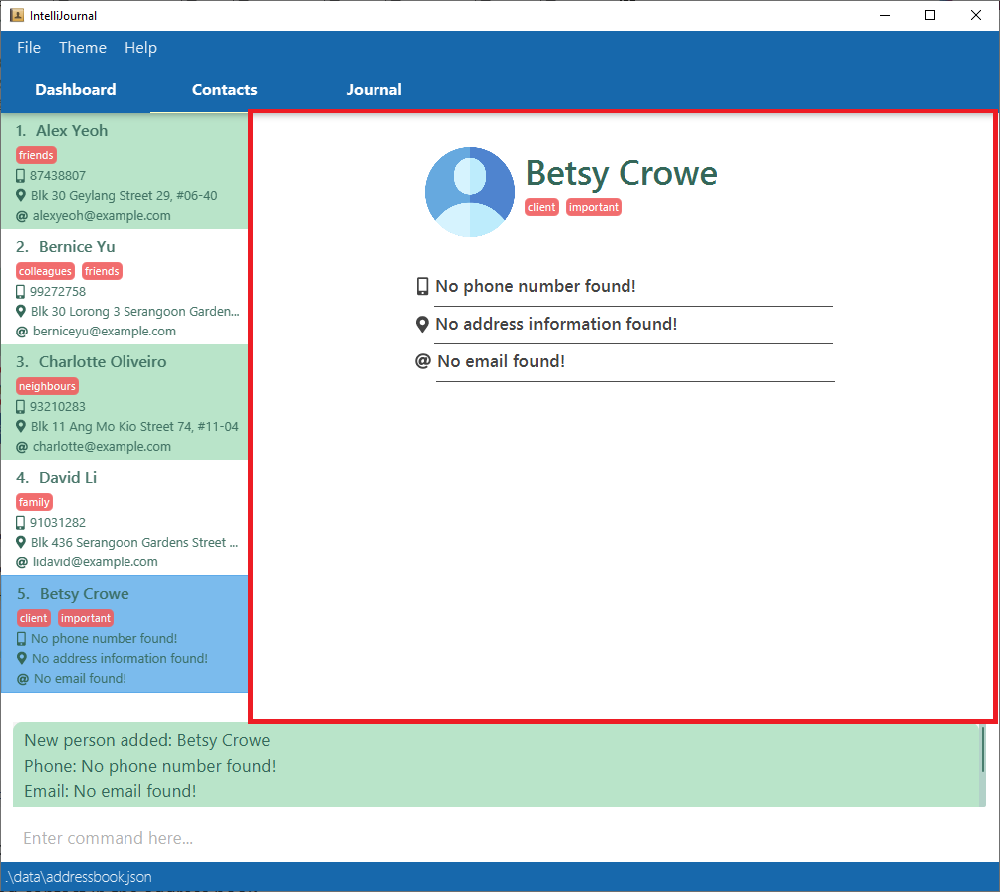

#### Listing all contacts: `listc`

Lists all the contacts in the address book.

Aliases: `listc`, `lc`

Format: `listc`

Example:

1. Type `listc` into the command box and press enter.

   

1. You will be directed to the address book tab, with all the contacts listed
   on the sidebar.

   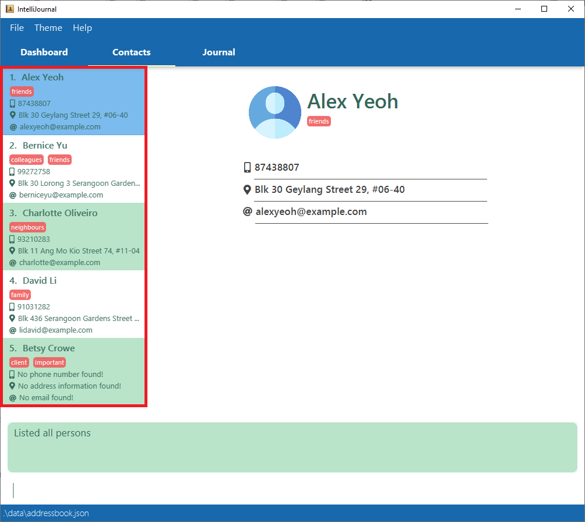

#### Editing a contact: `editc`

Edits an existing contact in the address book.

Aliases: `editc`, `edc`

Format: `editc INDEX [n/NAME] [p/PHONE_NUMBER] [e/EMAIL] [a/ADDRESS] [t/TAG]…​`

:bulb: **Tips:** 

* Edits the contact at the specified `INDEX`. The index refers to the index
  number shown in the displayed contact list.
* `NAME` must not be a name that is already used in the address book, even if it has different case letters.
* At least one of the optional fields must be provided.
* Existing values will be updated to the input values.
* `TAG` must be alphanumeric, without spaces.
* `PHONE_NUMBER` must be a valid Singaporean number, 8 digits long and starting with either 6, 8, or 9.
* The country code +65 is also accepted at the start of `PHONE_NUMBER`.
* When editing tags, the existing tags of the contact will be removed
  i.e adding of tags is not cumulative.
* You can remove all the contact’s tags by typing t/ without specifying any tags
  after it.
* After editing a contact, the list displayed in the `Contacts` tab will be
  reset to show all existing contacts, because the previous filtering operation
  may not still have the same effects on the edited contact.

Example:

1. Type `editc 2 n/Betsy Crowe t/ e/betsycrowe@example.com` into the command
   box and press enter.

   

1. This edits the name and email of the 2nd contact to `Betsy Crowe` and
   `betsycrowe@example.com` respectively, while removing all tags.

   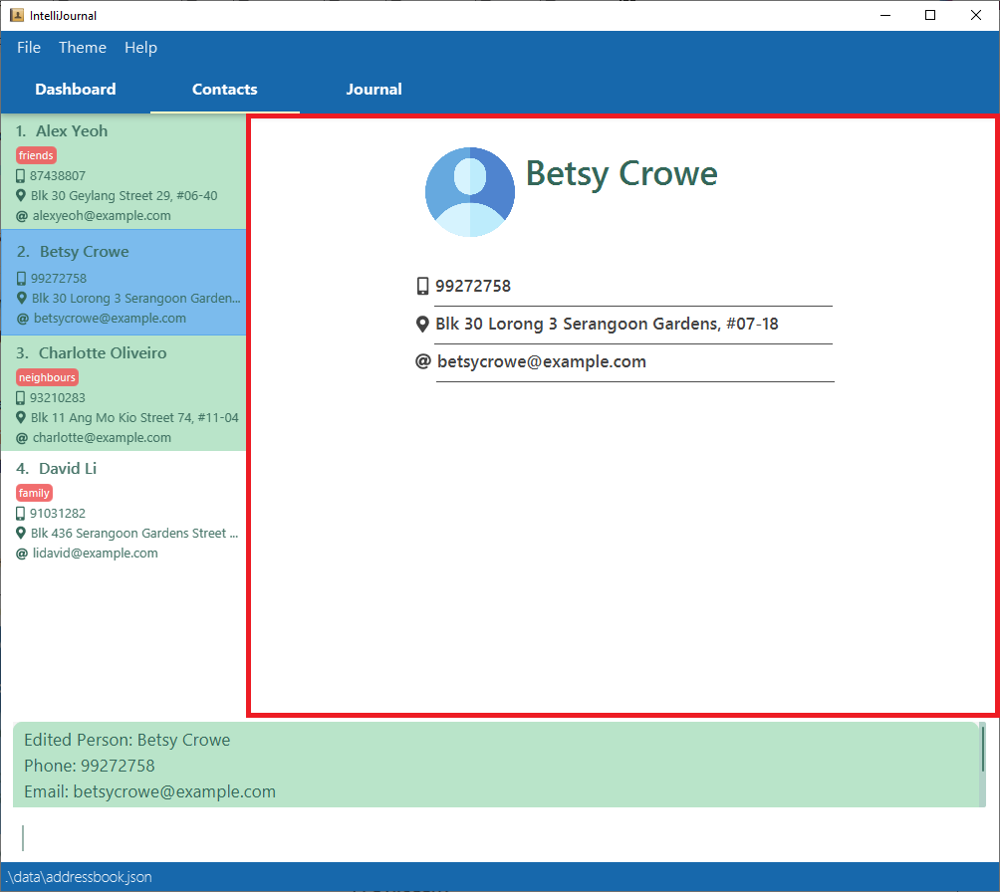

#### Viewing a contact: `viewc`

Opens up a contact in the current displayed list to show further details.

Aliases: `viewc`, `vc`

Format: `viewc INDEX`

* If you type a `viewc` command when IntelliJournal displays `Contact` tab,
  IntelliJournal will select the contact at the specified index and display
  its details on the right.
* If a `viewc` command is executed when IntelliJournal displays another tab
  (i.e. `Journal` tab or `Dashboard` tab), IntelliJournal will automatically
  navigate to the `Contact` tab, select the contact at the specified index,
  and display its details on the right.

:bulb: **Tips:** 

* `INDEX` refers to the index number of the contact in the **current displayed
  list**, instead of the index number of the contact in the full unfiltered
  list, which, for example, may have been filtered using a `findc` command. More
  details about a filtered contact list can be found under the
  [Finding contacts: `findc`](#finding-contacts-findc) section.

* `INDEX` must be a positive integer, which does not exceed the number of
  contacts in the current displayed list.

Example:

1. Open the `Contacts` tab, IntelliJournal should display a list of contacts on
   the left with detailed content on the right. If no contact has been selected
   to display, IntelliJournal will automatically select the first contact to
   show its details.

   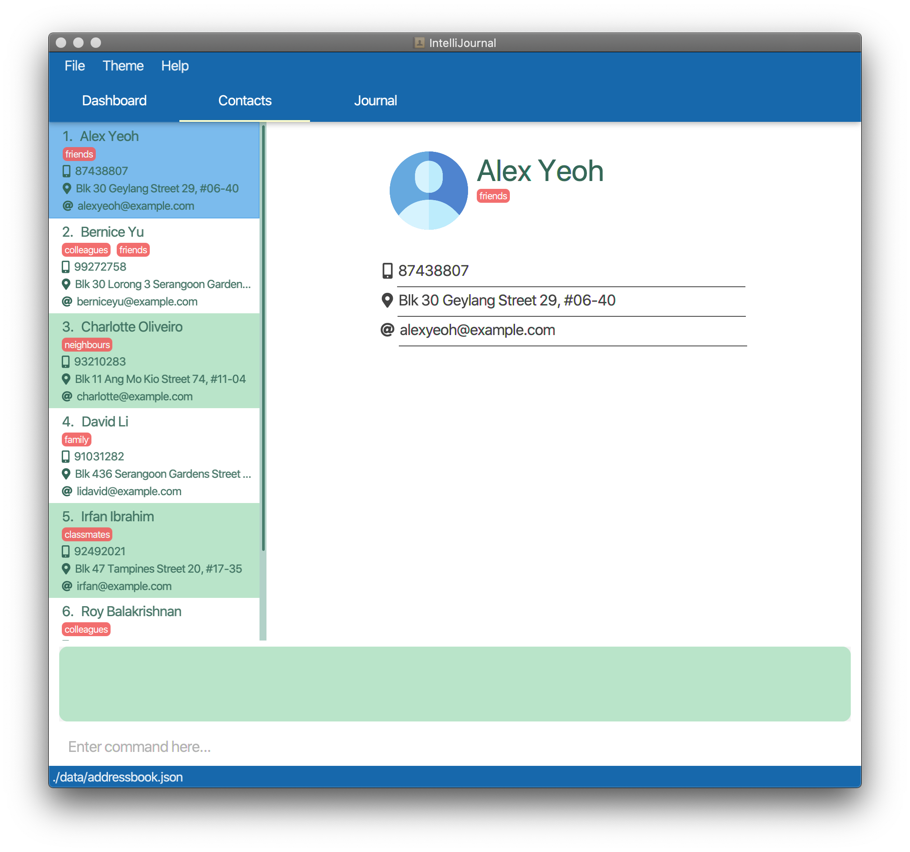

1. Type command `vc 4`, or equivalently, `viewc 4`, IntelliJournal will select
   the 4th contact in the list, and display its details on the right. Note that
   the red rectangle is for demonstration purpose instead of being part of the
   application interface.

   

#### Finding contacts: `findc`

Finds a list of contacts that satisfy the requirements
on particular fields given by the user.

Aliases: `findc`, `fc`

Format: `findc [n/NAME_KEYWORDS] [p/PHONE_KEYWORDS] [e/EMAIL_KEYWORDS]
        [a/ADDRESS_KEYWORDS] [t/TAG]…​`

:bulb: **Tips:** 

* `TAG` must be alphanumeric, without spaces.
* Note that for `TAG`, IntelliJournal searches for the exact same tag instead of
  tags containing any part of the searched terms, so tags are case-sensitive.

Example:

1. Type `findc n/Charlotte a/Ang Mo Kio` into the command box and press enter.

   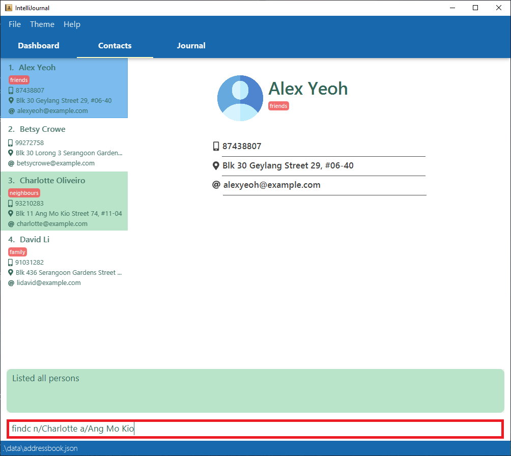

1. This finds all contacts whose name contains `Charlotte` and with an address
   containing `Ang Mo Kio`.

   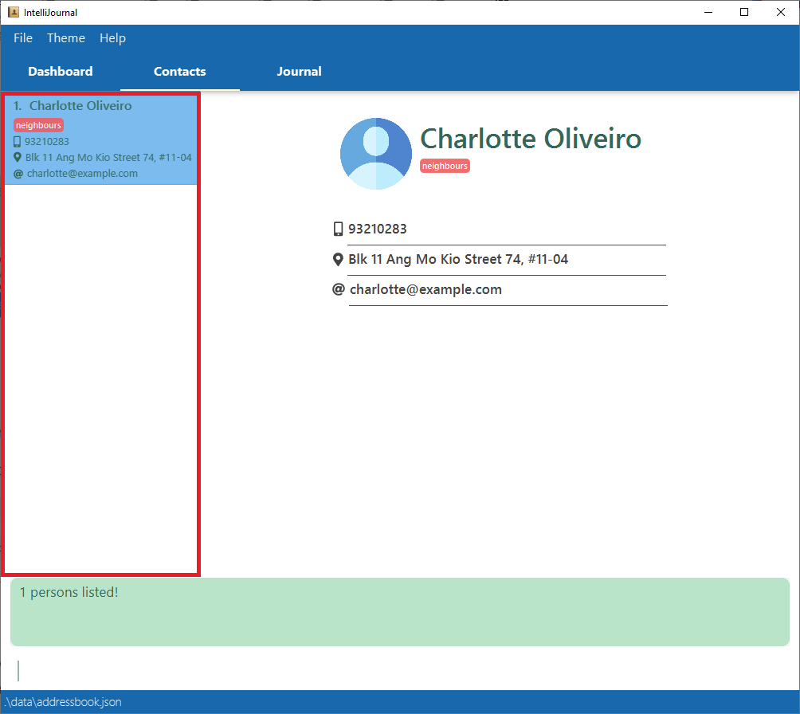

#### Deleting a contact: `deletec`

Deletes a contact from the address book.

Aliases: `deletec`, `delc`

Format: `deletec INDEX`

:bulb: **Tip:** `INDEX` refers to the index number of the contact in the list.

Example:

1. Type `deletec 2` into the command box and press enter.

   

1. This deletes the 2nd contact in the address book.

   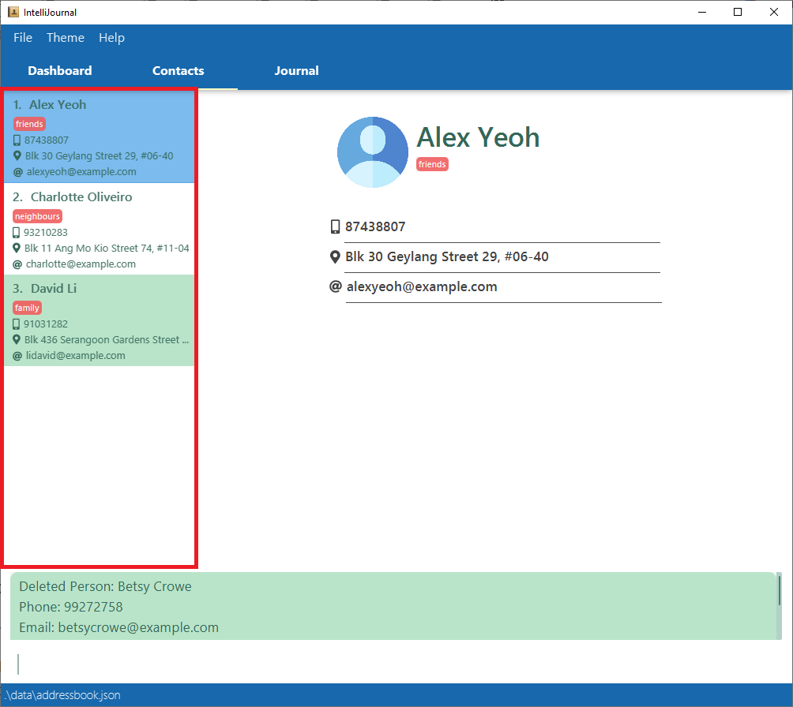

#### Clearing the address book: `clearc`

Clears all contacts in the addressbook.

Aliases: `clearc`, `cc`

Format: `clearc`

Example:

1. Type `clearc` into the command box and press enter.

   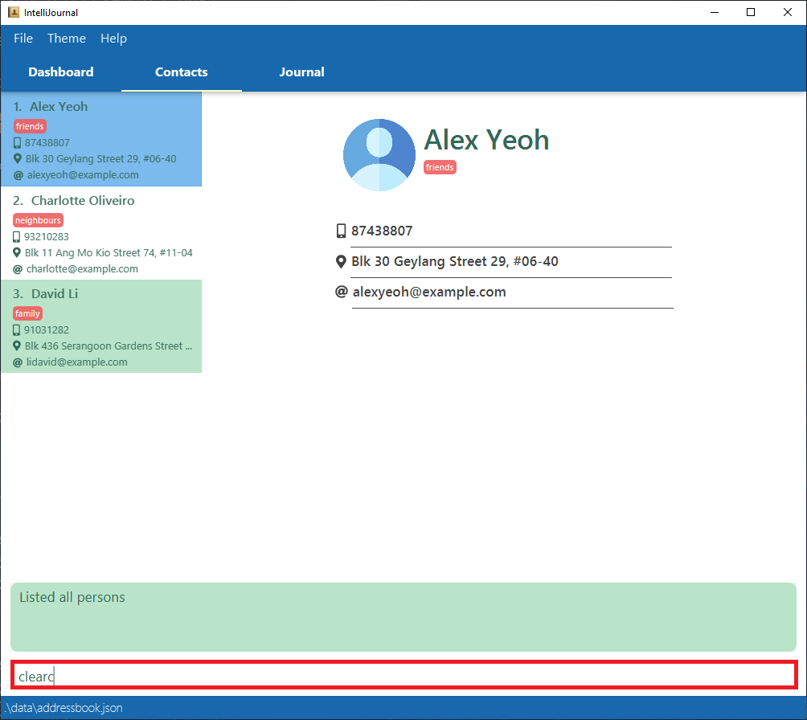

1. This removes all contacts in the address book.

   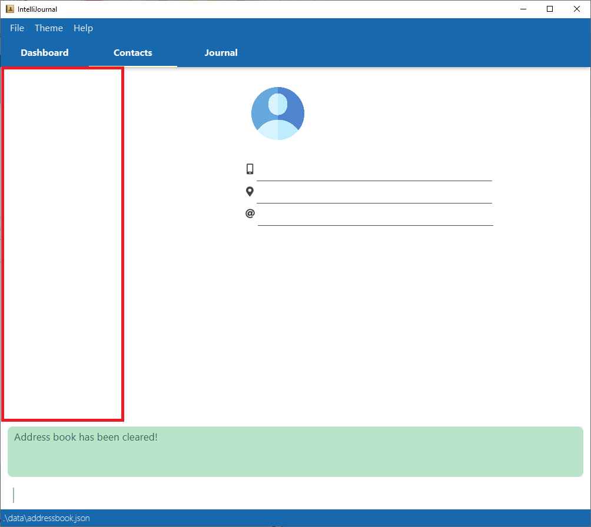

### Journal Entries

#### Adding a journal entry: `addjournal`

Adds a journal entry to the journal. After adding the journal entry, the app will
move to the `Journal` tab, scrolling to the entry you just added, displaying the
information of that entry on the right.

Aliases: `addjournal`, `addj`

Format: `addjournal n/TITLE [at/DATE_AND_TIME] [d/DESCRIPTION]
         [with/CONTACT_NAME]…​ [t/TAG]…​`

:bulb: **Tips:** 

* A journal entry can have any number of contacts or tags (including 0)
* `CONTACT_NAME` must be an existing name in the address book.
* `CONTACT_NAME` is case-insensitive, and does not need to be capitalised to find contacts required.
* `DATE_AND_TIME` must be in the format: "YYYY-MM-DD HH:MM".
* `TAG` must be alphanumeric, without spaces.

Example:

1. Type `addjournal n/Meeting with client at/2020-09-20 14:00 d/Tea` into the
    command box and press enter.

    

1. This creates a journal entry with the title `Meeting with client`, occurring
   at `2020-09-20 14:00` and with description `Tea`.

    

#### Listing all journal entries: `listj`

Lists all journal entries in the journal.

Aliases: `listj`, `lj`

Format: `listj`

Example:

1. Type `listj` into the command box and press enter.

    

1. You will be directed to the journal tab, with all the journal entries listed
   on the sidebar.

    

#### Editing a journal entry: `editj`

Edits an existing entry in the journal.

Aliases: `editj`, `edj`

Format: `editj INDEX [n/TITLE] [at/DATE_AND_TIME] [d/DESCRIPTION]
         [with/CONTACT_NAME]…​ [t/TAG]…​`

:bulb: **Tips:** 

* Edits the contact at the specified `INDEX`. The index refers to the index
  number shown in the displayed contact list.
* `CONTACT_NAME` is case-insensitive, and does not need to be capitalised to find contacts required.
* At least one of the optional fields must be provided.
* Existing values will be updated to the input values.
* When editing tags, the existing tags of the entry will be removed i.e adding
  of tags is not cumulative.
* You can remove all the entry's tags by typing t/ without specifying any tags
  after it.
* After editing a journal entry, the list displayed in the `Journal` tab will be
  reset to show all existing contacts, because the previous filtering operation
  may not still have the same effects on the edited contact.
* `DATE_AND_TIME` must be in the format: "YYYY-MM-DD HH:MM"
* `TAG` must be alphanumeric, without spaces.

Example:

1. Type `editj 1 n/Meeting with client at/2020-09-20 14:00 d/Tea` into the
   command box and press enter.

   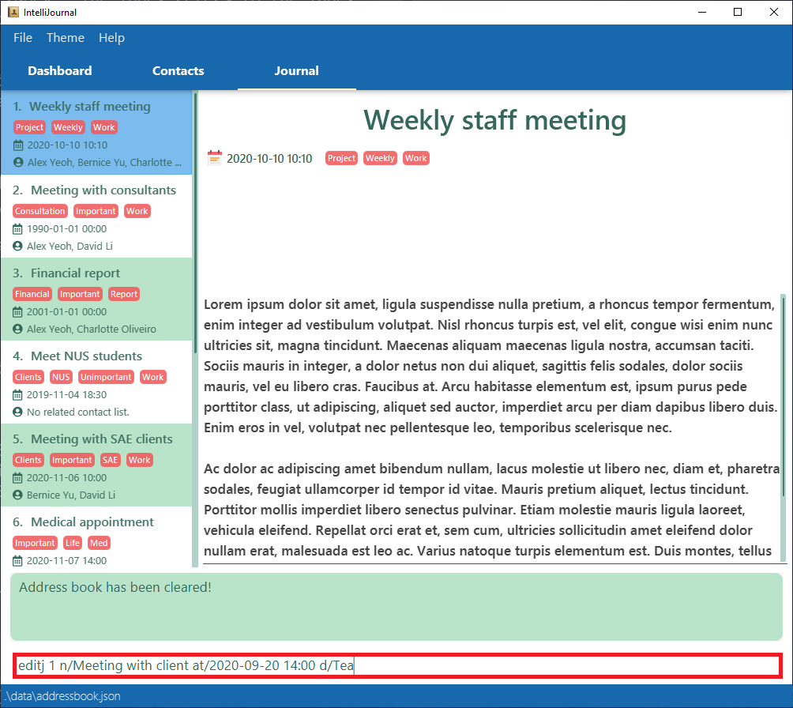

2. This edits the title, date and description of the first journal entry to be
   `Meeting with client`, `2020-09-20 14:00` and `Tea` respectively.

   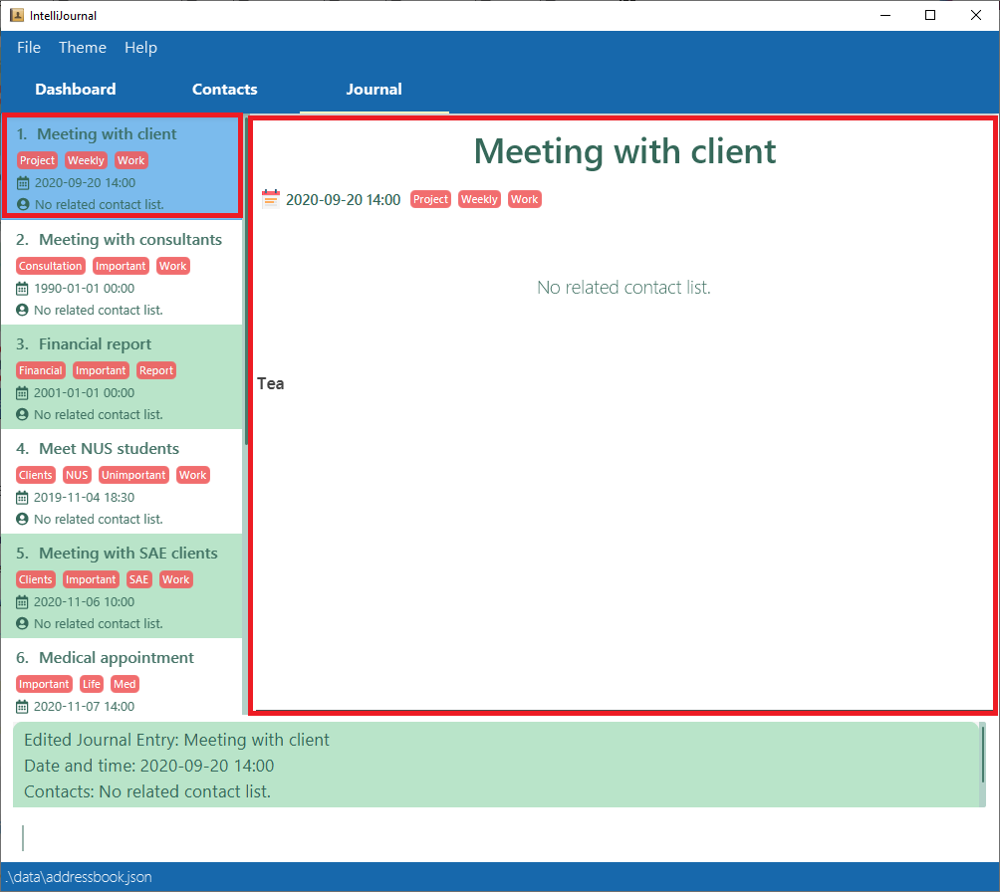

#### Viewing a journal entry: `viewj`

Opens up a journal entry in the current displayed list to show further details.

Aliases: `viewj`, `vj`

Format: `viewj INDEX`

* If you type a `viewj` command when IntelliJournal displays `Journal` tab,
IntelliJournal will select the journal entry at the specified index and display
its details on the right.
* If a `viewj` command is executed when IntelliJournal displays another tab
(i.e. `Contacts` tab or `Dashboard` tab), IntelliJournal will automatically
navigate to the `Journal` tab, select the journal entry at the specified index,
and display its details on the right.

:bulb: **Tips:** 

* `INDEX` refers to the index number of the journal entry in the **current displayed
list**, instead of the index number of the journal entry in the full unfiltered list,
which, for example, may have been filtered using a `findj` command. More details
about a filtered journal entry list can be found under the
[Finding journal entries: `findj`](#finding-journal-entries-findj) section.

* `INDEX` must be a positive integer, which does not exceed the number of journal entries
in the current displayed list.

Example:

1. Open the `Journal` tab, IntelliJournal should display a list of journal
   entries on the left with detailed content on the right. If no entry has been
   selected to display, IntelliJournal will automatically select the first entry
   to show its details.

   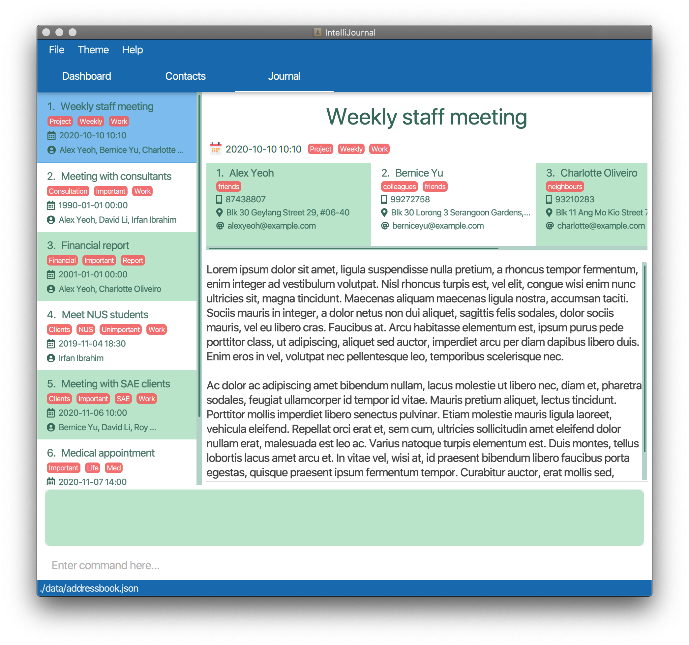

1. Type command `vj 4`, or equivalently, `viewj 4`, IntelliJournal will select
   the 4th entry in the list, and display its details on the right. Note that
   the red rectangle is for demonstration purpose instead of being part of the
   application interface.

   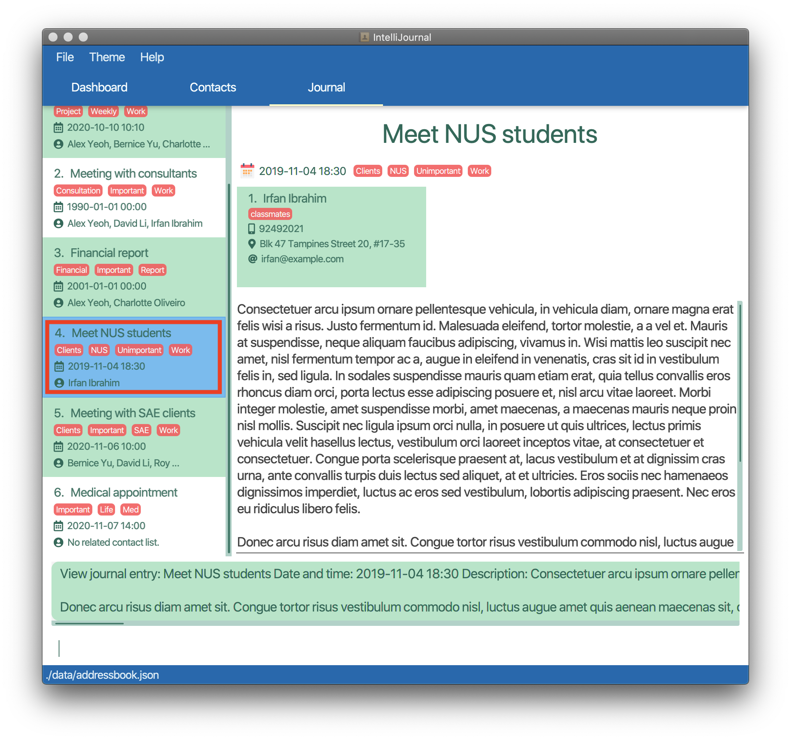

#### Finding journal entries: `findj`

Finds a list of journal entries that satisfy the requirements
on particular fields given by the user.

Aliases: `findj`, `fj`

Format: `findj [n/TITLE_KEYWORDS] [at/DATE_AND_TIME]
         [with/CONTACT_NAME_KEYWORDS]…​ [d/DESCRIPTION_KEYWORDS] [t/TAG]…​`

:bulb: **Tips:** 

* `DATE_AND_TIME` must be in the format: "YYYY-MM-DD HH:MM"
* `TAG` must be alphanumeric, without spaces.
* Note that for `TAG`, IntelliJournal searches for the exact same tag instead of
  tags containing any part of the searched terms, so tags are case-sensitive.

Example:

1. Type `findj n/Meeting` into the command box and press enter.

   

1. This finds all journal entries with a title containing `Meeting`.

   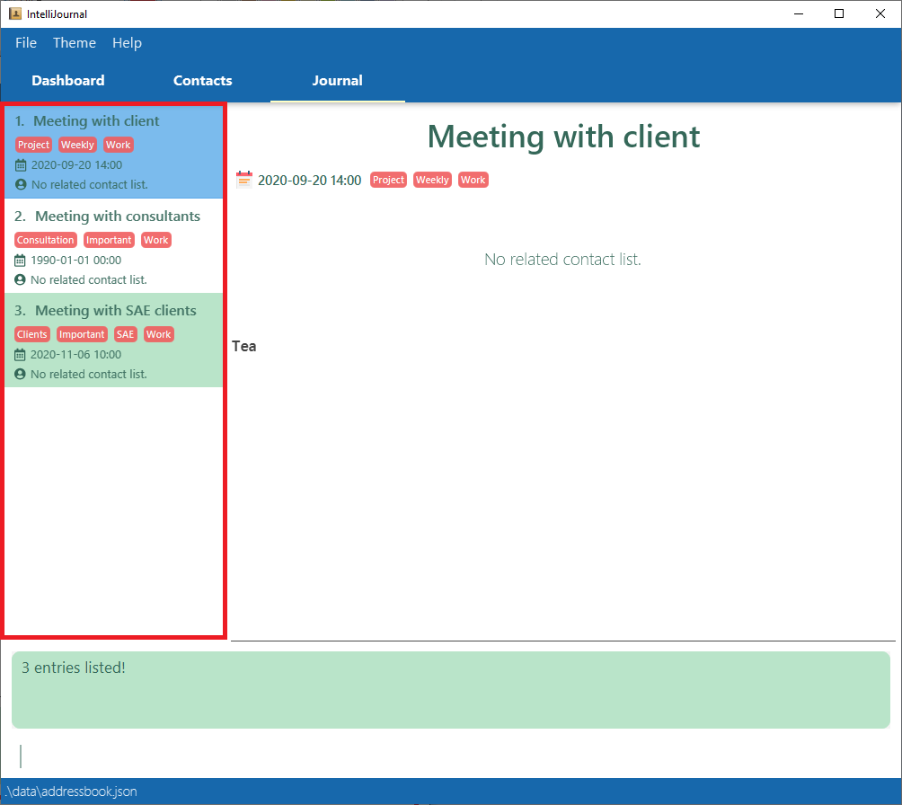

#### Checking schedule: `check`

Finds a list of journal entries for a date given by the user.

Aliases: `check`, `ck`

Format: `check [DATE]`

Example 1:

1. Type `check 2020-09-20` into the command box and press enter.

    

1. This finds a list of journal entries on the date 2020-09-20.

    

Example 2:

1. Type `check` into the command box and press enter. This finds a list of
   journal entries on the current date.

    

1. This finds a list of journal entries on the current date
   (2020-11-04 in the example).

    

#### Deleting a journal entry: `deletej`

Deletes a journal entry from the journal.

Aliases: `deletej`, `delj`

Format: `deletej INDEX`

* `INDEX` refers to the index number of the journal shown in the list.

Example:

1. Type `deletej 5` into the command box and press enter.

    

1. This deletes the 5th journal entry in the journal.

    

#### Clearing the journal: `clearj`

Clears all journal entries in the journal.

Aliases: `clearj`, `cj`

Format: `clearj`

Example:

1. Type `clearj` into the command box and press enter.

    

1. This removes all journal entries in the journal.

    

### Miscellaneous

#### Viewing help menu: `help`

Gives the explanation and format of commands in the system and does not change
the current displaying tab.

Aliases: `help`, `h`

Format: `help [of/COMMAND]`

* The `of/COMMAND` argument supplied will indicate which command explanation to
  show.
* If no `of/COMMAND` argument is supplied, you will see a new window containing
the link to our User Guide.

Example 1:

1. Type `help of/addc` in the command box and press enter.

    

1. The information pane should give you information on how to use the `addc`
   command.

   

Example 2:

1. Type `help` in the command box and press enter.

    

1. There should be a pop-up with a link to this user guide.

    

#### Switching the display tab: `switch`

Switches the current displaying tab to the other tab.

Aliases: `switch`, `swt`

Format: `switch`

Example:

1. Type `switch` in the command box and press enter.

   

1. This switches the display to the next tab.

   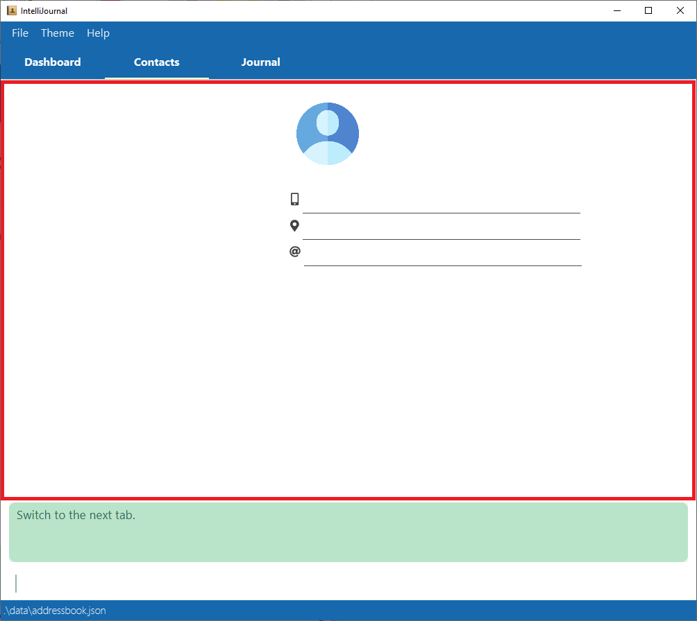

<!--@@author {Lingy12}-->
#### Adding aliases for existing commands: `alias`

Adds your preferred shortcut for existing commands.

Aliases: `alias`, `al`

Format: `alias TARGET ALIAS`

* `TARGET`: Existing command or alias in the IntelliJournal.
* `ALIAS`: The personalized shortcut you want to add into the system.

**:information_source: Note:** 

* We have provided some default shortcuts which can be found in
  [Command Summary](#command-summary), you can use `alias` command to add your
  personalized command alias.
* You can add a shortcut according to existing shortcut. eg. If you have added
  `st` as a shortcut for `switch`, you can use `alias st si`. You will add `si`
  as a valid alias for switch as well.
* **Warning**: IntelliJournal will not be able to have a single alias for two
  different commands.
   Eg. If `st` has been added to the system, it will confuse IntelliJournal
  if you ask it to add `st` as a valid alias for `check` or other command.

Example:

1. Type `alias switch st` into the command box and press enter.

   

2. This adds `st` as a valid shortcut for `switch`

   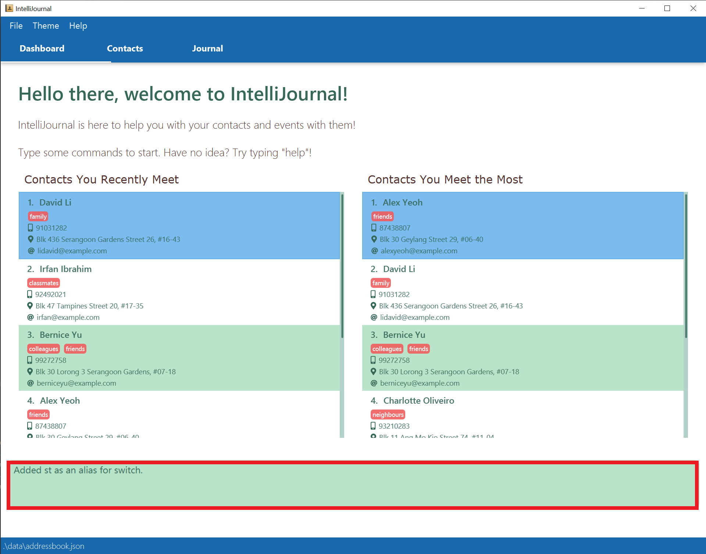

3. Then you can type `st` into the command box and press enter.

   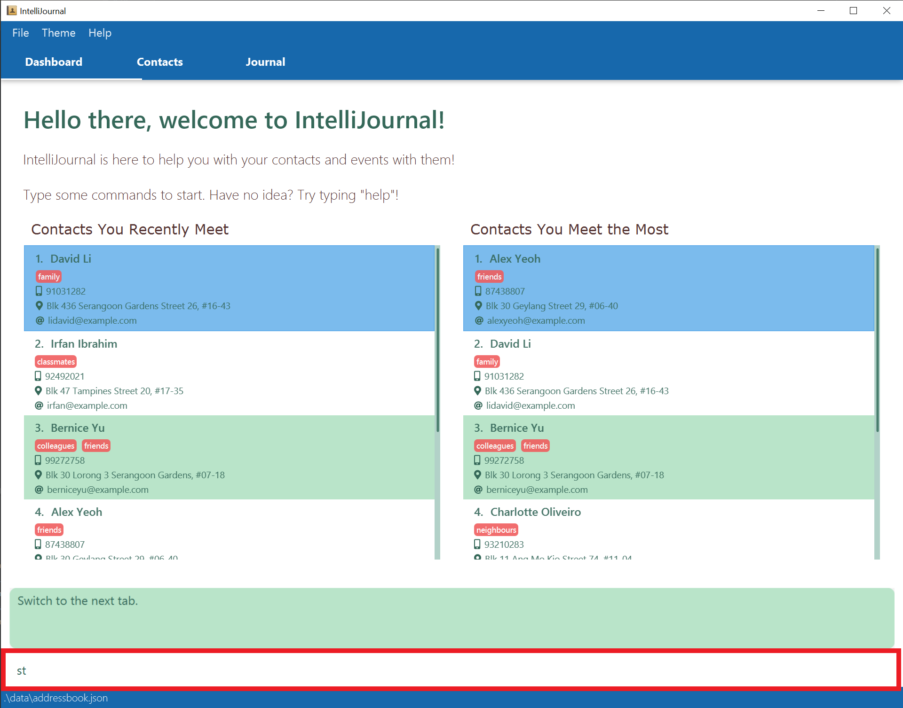

4. IntelliJournal will switch the tab which is what `switch` command does

   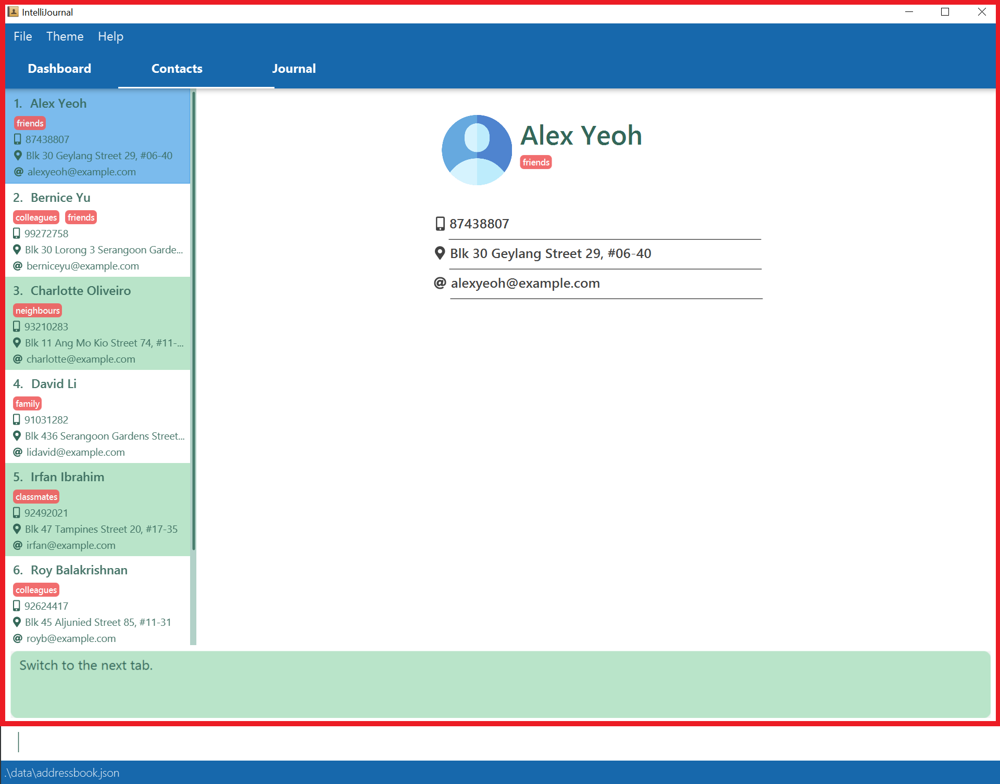

<!-- @@author -->
#### Deleting custom aliases: `deletea`

Removes the custom alias from IntelliJournal.

Aliases: `deletea`, `dela`

Format: `deletea ALIAS`

**:information_source: Note:** 

* Default alias cannot be removed.

Example:

1. Assuming you have added `st` as an alias for `switch`, type `deletea st` into
   the command box and press enter.

    

1. This removes `st` from IntelliJournal.

    

1. If you try to use `st` again, IntelliJournal will tell you that the command
   is not recognised.

    

#### Changing the main color theme: `changetheme`

You can use this command to choose between two main color scheme of IntelliJournal.
One is dark theme and the other is bright theme mainly.

Aliases: `changetheme`, `ctheme`

Format: `changetheme`

Example:

1. Type `changetheme` into the command box and press enter.

   

1. This changes the theme of IntelliJournal.

   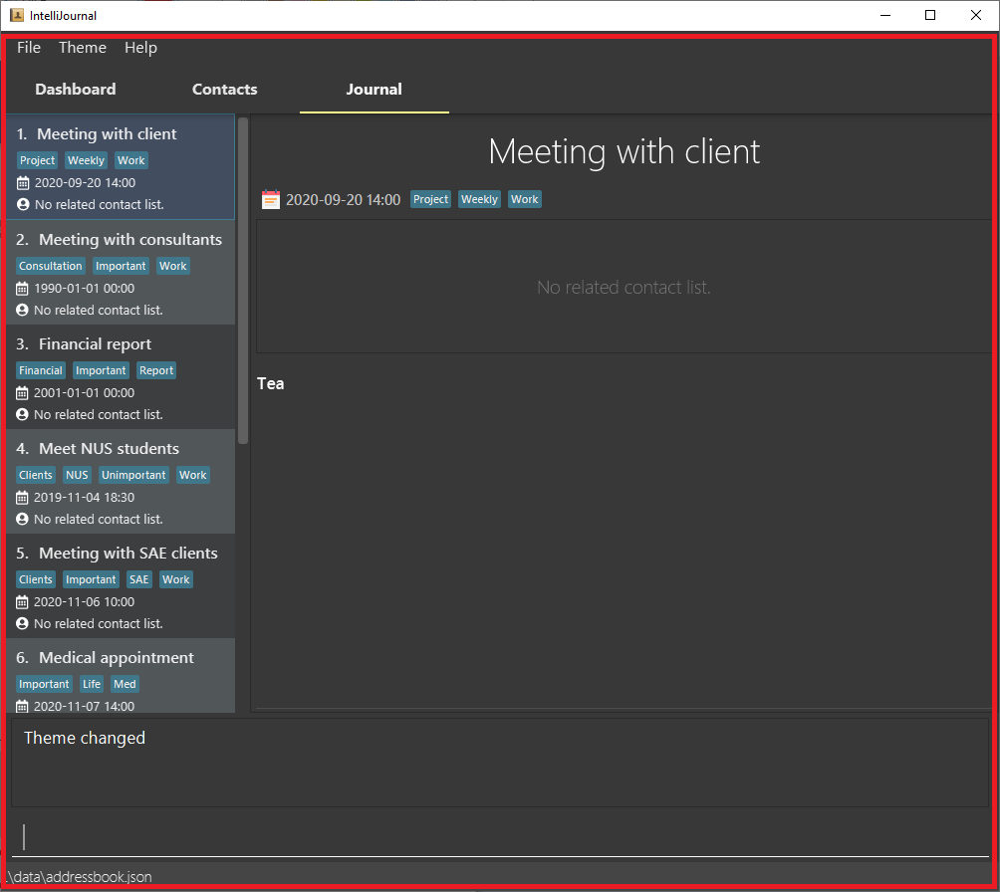

#### Exiting the program: `exit`

Exits the program.

Aliases: `exit`, `quit`, `q`

Format: `exit`

Example:

1. Type `exit` into the command box and press enter.

   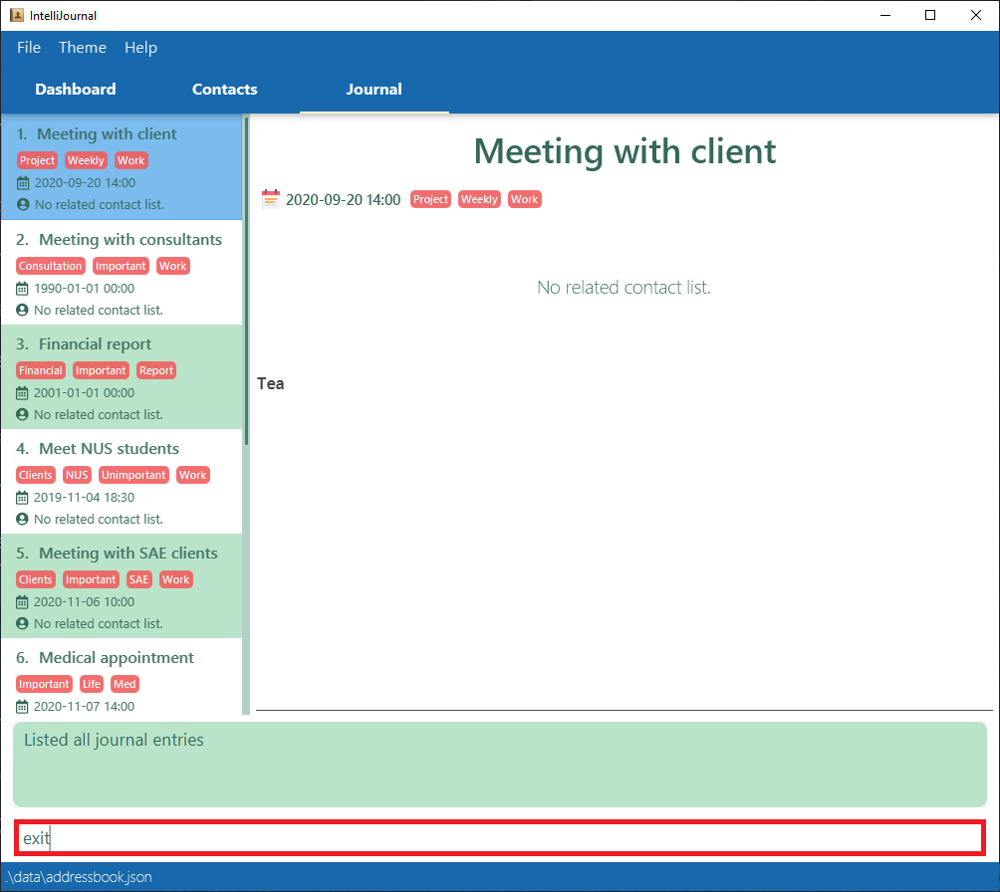

1. This exits out of IntelliJournal.

#### Saving the data

IntelliJournal data is saved in the hard disk automatically after any command
that changes the data. There is no need to save manually.

---

## FAQ

**Q**: How do I transfer my data to another Computer? 
**A**: Install the app in the other computer and overwrite the empty data file
it creates with the file that contains the data of your previous
IntelliJournal home folder.

---

## Command Summary

### Contacts

<table>
  <thead>
        <tr>
            <th>Command</th>
            <th>Format</th>
        </tr>
    </thead>
    <tbody>
        <tr>
            <td rowspan="2"><b>Adding a contact</b></td>
            <td>
                <code>
                    addcontact n/NAME [p/PHONE_NUMBER] [e/EMAIL] [a/ADDRESS]
                    [t/TAG]…​
                </code>
            </td>
        </tr>
        <tr>
            <td>
                <code>
                    addc n/NAME [p/PHONE_NUMBER] [e/EMAIL] [a/ADDRESS] [t/TAG]…​
                </code>
            </td>
        </tr>
        <tr>
            <td rowspan="2"><b>Listing all contacts</b></td>
            <td><code>listc</code></td>
        </tr>
        <tr>
            <td><code>lc</code></td>
        </tr>
        <tr>
            <td rowspan="2"><b>Editing a contact</b></td>
            <td>
                <code>
                    editc INDEX [n/NAME] [p/PHONE_NUMBER] [e/EMAIL] [a/ADDRESS]
                    [t/TAG]…​
                </code>
            </td>
        </tr>
        <tr>
            <td>
                <code>
                    edc INDEX [n/NAME] [p/PHONE_NUMBER] [e/EMAIL] [a/ADDRESS]
                    [t/TAG]…​
                </code>
            </td>
        </tr>
        <tr>
            <td rowspan="2"><b>Viewing a contact</b></td>
            <td><code>viewc INDEX</code></td>
        </tr>
        <tr>
            <td><code>vc INDEX</code></td>
        </tr>
        <tr>
            <td rowspan="2"><b>Finding contacts</b></td>
            <td>
                <code>
                    findc [n/NAME_KEYWORDS] [p/PHONE_KEYWORDS]
                    [e/EMAIL_KEYWORDS] [a/ADDRESS_KEYWORDS] [t/TAG]…​
                </code>
            </td>
        </tr>
        <tr>
            <td>
                <code>
                    fc [n/NAME_KEYWORDS] [p/PHONE_KEYWORDS]
                    [e/EMAIL_KEYWORDS] [a/ADDRESS_KEYWORDS] [t/TAG]…​
                </code>
            </td>
        </tr>
        <tr>
            <td rowspan="2"><b>Deleting a contact</b></td>
            <td><code>deletec INDEX</code></td>
        </tr>
        <tr>
            <td><code>delc INDEX</code></td>
        </tr>
        <tr>
            <td rowspan="2"><b>Clearing the address book</b></td>
            <td><code>clearc</code></td>
        </tr>
        <tr>
            <td><code>cc</code></td>
        </tr>
    </tbody>
</table>

### Journal Entries

<table>
  <thead>
        <tr>
            <th>Command</th>
            <th>Format</th>
        </tr>
    </thead>
    <tbody>
        <tr>
            <td rowspan="3"><b>Adding a journal entry</b></td>
            <td>
                <code>
                    addjournal n/TITLE [at/DATE_AND_TIME] [d/DESCRIPTION]
                    [with/CONTACT_NAME]…​ [t/TAG]…​
                </code>
            </td>
        </tr>
        <tr>
            <td>
                <code>
                    addj n/TITLE [at/DATE_AND_TIME] [d/DESCRIPTION]
                    [with/CONTACT_NAME]…​ [t/TAG]…​
                </code>
            </td>
        </tr>
        <tr>
            <td>
                <code>
                    adde n/TITLE [at/DATE_AND_TIME] [d/DESCRIPTION]
                    [with/CONTACT_NAME]…​ [t/TAG]…​
                </code>
            </td>
        </tr>
        <tr>
            <td rowspan="2"><b>Listing all journal entries</b></td>
            <td><code>listj</code></td>
        </tr>
        <tr>
            <td><code>lj</code></td>
        </tr>
        <tr>
            <td rowspan="2"><b>Editing a journal entry</b></td>
            <td>
                <code>
                    editj INDEX [n/TITLE] [at/DATE_AND_TIME] [d/DESCRIPTION]
                    [with/CONTACT_NAME]…​ [t/TAG]…​
                </code>
            </td>
        </tr>
        <tr>
            <td>
                <code>
                    edj INDEX [n/TITLE] [at/DATE_AND_TIME] [d/DESCRIPTION]
                    [with/CONTACT_NAME]…​ [t/TAG]…​
                </code>
            </td>
        </tr>
        <tr>
            <td rowspan="2"><b>Viewing a journal entry</b></td>
            <td><code>viewj INDEX</code></td>
        </tr>
        <tr>
            <td><code>vj INDEX</code></td>
        </tr>
        <tr>
            <td rowspan="2"><b>Finding journal entries</b></td>
            <td>
                <code>
                    findj [n/TITLE_KEYWORDS] [at/DATE_AND_TIME]
                    [with/CONTACT_NAME_KEYWORDS]…​ [d/DESCRIPTION_KEYWORDS]
                    [t/TAG]…​
                </code>
            </td>
        </tr>
        <tr>
            <td>
                <code>
                    fj [n/TITLE_KEYWORDS] [at/DATE_AND_TIME]
                    [with/CONTACT_NAME_KEYWORDS]…​ [d/DESCRIPTION_KEYWORDS]
                    [t/TAG]…​
                </code>
            </td>
        </tr>
        <tr>
            <td rowspan="2"><b>Checking schedule</b></td>
            <td><code>check [DATE]</code></td>
        </tr>
        <tr>
            <td><code>ck [DATE]</code></td>
        </tr>
        <tr>
            <td rowspan="2"><b>Deleting a journal entry</b></td>
            <td><code>deletej INDEX</code></td>
        </tr>
        <tr>
            <td><code>delj INDEX</code></td>
        </tr>
        <tr>
            <td rowspan="2"><b>Clearing the journal</b></td>
            <td><code>clearj</code></td>
        </tr>
        <tr>
            <td><code>cj</code></td>
        </tr>
    </tbody>
</table>

### Miscellaneous

<table>
  <thead>
        <tr>
            <th>Command</th>
            <th>Format</th>
        </tr>
    </thead>
    <tbody>
        <tr>
            <td rowspan="2"><b>Viewing help menu</b></td>
            <td><code>help [COMMAND]</code></td>
        </tr>
        <tr>
            <td><code>h [COMMAND]</code></td>
        </tr>
        <tr>
            <td rowspan="2"><b>Switching the display tab</b></td>
            <td><code>switch</code></td>
        </tr>
        <tr>
            <td><code>swt</code></td>
        </tr>
        <tr>
            <td rowspan="2"><b>Adding aliases for existing commands</b></td>
            <td><code>alias TARGET ALIAS</code></td>
        </tr>
        <tr>
            <td><code>al TARGET ALIAS</code></td>
        </tr>
        <tr>
            <td rowspan="2"><b>Deleting custom aliases</b></td>
            <td><code>deletea ALIAS</code></td>
        </tr>
        <tr>
            <td><code>dela ALIAS</code></td>
        </tr>
        <tr>
            <td rowspan="2"><b>Changing the color theme</b></td>
            <td><code>changetheme</code></td>
        </tr>
        <tr>
            <td><code>ctheme</code></td>
        </tr>
        <tr>
            <td rowspan="3"><b>Exiting the program</b></td>
            <td><code>exit</code></td>
        </tr>
        <tr>
            <td><code>quit</code></td>
        </tr>
        <tr>
            <td><code>q</code></td>
        </tr>
    </tbody>
</table>

