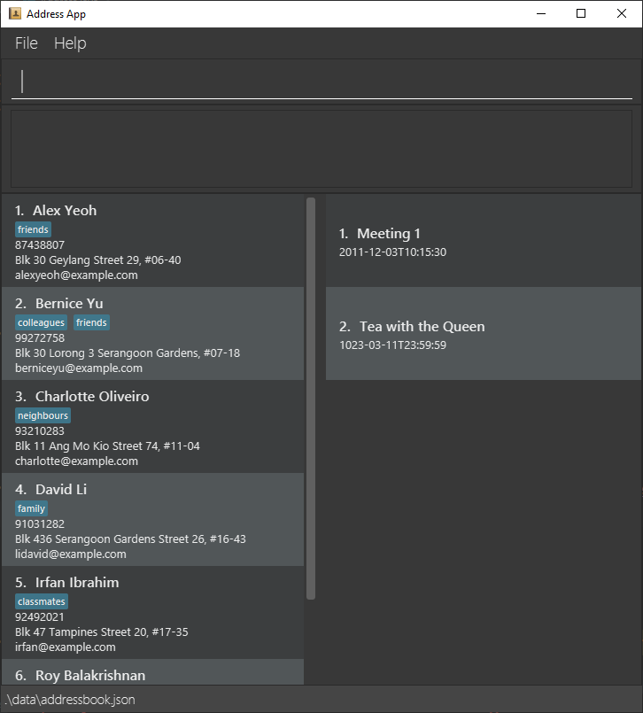

IntelliJournal is a **desktop app for managing journals as well as contacts,
optimised for use via a Command Line Interface** (CLI) while still having the
benefits of a Graphical User Interface (GUI). If you can type fast, 
IntelliJournal can help you record down journal entries with contacts as well
as location information faster than traditional GUI apps.

* Table of Contents
{:toc}

--------------------------------------------------------------------------------------------------------------------

## Quick start

1. Ensure you have Java `11` or above installed in your Computer.

1. Download the latest `addressbook.jar` from [here](https://github.com/se-edu/addressbook-level3/releases).

1. Copy the file to the folder you want to use as the _home folder_ for your AddressBook.

1. Double-click the file to start the app. The GUI similar to the below should appear in a few seconds. Note how the app contains some sample data. 
   

1. Type the command in the command box and press Enter to execute it. e.g. typing **`help`** and pressing Enter will open the help window. 
   Some example commands you can try:

   * **`list`** : Lists all contacts.

   * **`add`**`n/John Doe p/98765432 e/johnd@example.com a/John street, block 123, #01-01` : Adds a contact named `John Doe` to the Address Book.

   * **`remove`**`3` : Removes the 3rd contact shown in the current list.

   * **`exit`** : Exits the app.

1. Refer to the [Features](#features) below for details of each command.

--------------------------------------------------------------------------------------------------------------------

## Features

**:information_source: Notes about the command format:** 

* Words in `UPPER_CASE` are the parameters to be supplied by the user. 
  e.g. in `add n/NAME`, `NAME` is a parameter which can be used as 
  `add n/John Doe`.

* Items in square brackets are optional. 
  e.g `n/NAME [t/TAG]` can be used as `n/John Doe t/friend` or as `n/John Doe`.

* Items with `…`​ after them can be used multiple times including zero 
  times. 
  e.g. `[t/TAG]…​` can be used as ` ` (i.e. 0 times), `t/friend`,
  `t/friend t/family` etc.

* Parameters can be in any order. 
  e.g. if the command specifies `n/NAME p/PHONE_NUMBER`, `p/PHONE_NUMBER n/NAME` is also acceptable.

### Viewing help menu: `help`

Gives the explanation and format of commands in the system.

Format: `help [COMMAND]`
* The `COMMAND` argument supplied will indicate which command explanation to 
show.
* If no `COMMAND` argument is supplied, all commands will be shown.

### Adding a contact/journal entry: `add`

Adds a contact to the address book or journal entry to the journal.

Format: `add OPTION/ n/NAME [p/PHONE_NUMBER] [e/EMAIL] [a/ADDRESS] [d/DATE_AND_TIME] [i/INFORMATION] [t/TAG]…​`
* The option indicates what is to be added, `c/` for adding contacts, `j/` for
adding journal entries.

:bulb: **Tip:**
A contact/journal entry can have any number of tags (including 0)

Examples:
* `add c/ n/John Doe` Adds a contact with the name of `Robert`.
* `add c/ n/Betsy Crowe t/client t/important` Adds a contact with the name of 
`Robert` and tags of `client` and `important`.
* `add j/ n/Meeting with client` Adds a journal entry with the name
`Meeting with client`.
* `add j/ n/Meeting with client d/2020-9-20 1400 i/Tea` Adds a journal 
entry with the name `Meeting with client`, a date and time of `2020-9-20 1400`
and content `Tea`.

### Listing all contacts/journal entries: `list`

Lists all the contacts in the address book or journal entries in the journal.

Format: `list OPTION/`
* The option indicates what is to be listed, `c/` for listing contacts, `j/` for
listing journal entries.

Examples:
* `list c/` Lists all contacts in the address book.
* `list j/` Lists all journal entries in the journal.

### Viewing contact/journal entry: `view`
Opens up a contact or journal entry to show further details.

Format `view OPTION/ INDEX`
* The option indicates what is to be viewed, `c/` for viewing contacts, `j/` for
viewing journal entries.
* `INDEX` refers to the index number of the contact/journal shown in the list.

Examples:
* `view c/ 4` Views the 4th contact in the address book.
* `view j/ 8` Views the 8th journal entry in the journal.

### Removing contact/journal entry: `remove`

Removes a contact from the address book or journal entry from the journal.

Format `remove OPTION/ INDEX`
* The option indicates what is to be removed, `c/` for removing contacts, `j/`
for removing journal entries.
* `INDEX` refers to the index number of the contact/journal shown in the list.

Examples:
* `remove c/ 4` Removes the 4th contact in the address book.
* `remove j/ 8` Removes the 8th journal entry in the journal.

### Exiting the program: `exit`

Exits the program.

Format: `exit`

### Saving the data

IntelliJournal data is saved in the hard disk automatically after any command 
that changes the data. There is no need to save manually.

--------------------------------------------------------------------------------------------------------------------

## FAQ

**Q**: How do I transfer my data to another Computer? 
**A**: Install the app in the other computer and overwrite the empty data file it creates with the file that contains the data of your previous AddressBook home folder.

--------------------------------------------------------------------------------------------------------------------

## Command Summary

| Command                                  | Format                                                             |
| :---                                     | :---                                                               |
| **Viewing help menu**                    | `help [COMMAND]`                                                   |
| **Adding a contact/journal entry**       | `add OPTION/ n/NAME [d/DATE_AND_TIME] [i/INFORMATION] [t/TAGS]...` |
| **Listing all contacts/journal entries** | `list OPTION/`                                                     |
| **Viewing contact/journal entry**        | `view OPTION/ INDEX`                                               |
| **Removing contact/journal entry**       | `remove OPTION/ INDEX`                                             |
| **Exiting the program**                  | `exit`                                                             |
